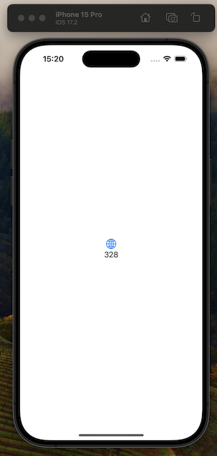

# Run structured fuzzing on ASN1Decoder in iOS simulator

A Swift iOS App that generates structured ASN1 objects from reproducible random data. The generated objects are used to fuzz the ASN1Decoder class and [uncovered a few bugs](https://github.com/weliveindetail/ASN1Kit/commits/de1dfb6c9bc47e3b2a9e3c64058fdff6237fc8a5) quickly.

## Tools

* Xcode 15.2 on arm64 macOS
* iOS Simulator for iPhone 15 Pro
* omvll-swift-frontend-shim-1.1.0
* omvll-macos-1.1.0

## Build and run

Build once to obtain the build directory in DerivedData, then:
```
% xcrun simctl list | grep Booted
    iPhone 15 Pro (7DB58EB8-4785-4DD2-A397-5233727EB85E) (Booted)
% rm -rf /Users/ez/Library/Developer/Xcode/DerivedData/MinimalGetter-bvsqyhdldqvpribcwvtmmkcbemaj/Build
% xcodebuild -configuration Release -arch arm64 -sdk iphonesimulator -scheme MinimalGetter clean build
% xcrun simctl install booted /Users/ez/Library/Developer/Xcode/DerivedData/MinimalGetter-bvsqyhdldqvpribcwvtmmkcbemaj/Build/Products/Release-iphonesimulator/MinimalGetter.app
% xcrun simctl launch booted build38.MinimalGetter > output.log
```

Check the number in the Simulator UI updates every second and is in range. Change the range `ContentView.swift -> getString() -> 300...400` to something else to make sure the right app is tested.



Expected output:
```
d7a28fa61733737f51b9a6b96292278f4ec8295b25f1e2417b21c9f8ebce992ece3b717f4be19ae57228bc0f4d1319d376baf5ba59e75e28984bf3dcd35a10ee == Primitive: [8fa6]
270737a30848f03bd74aae1383185874a8db90456feb0258ecdd60e20d8f88e594618f2ac6dfd65395ce3795d433f910e06913df744620a42ba576f8b396adf2malformedEncoding("Invalid universal tag: 7")
c1d257ff946d7f8be29d70cc81d04999deffe0c3fcdd1ae03dcfb21f6f973ac87fdb62d81977a98e85362cc4b73aee3b03fd062ab6b77c7c7e58667acabd101e == Primitive: [57ff]
384e441668d8d1c2c720c49da8814a4c6074f29d7484a7b2eb92954cd63b8da6abf86f537b518970c89bdecb6e288207adb675e9303e6e9a816a0a0ef805f150unsupported("Decoding tag: [0x18] as a constructed type is unsupported")
62183c5c5cc45f49451fc38c6dcb8817d1dae1ecc7665c08c07345559b8ced6206144256bc678d7a805bdbca03d9ca7d4b6387c0cdec9d7cc61587f27935e5c6 == [
	
]
4501d5c8c31c0c88ddd669bf9481de2b0d49fb62622e6ea8cba8f368420002269c11f3f4d79cddbeaf1672008abf766e4c88f1d41957fbc40b6b7dd3d85979df == Primitive: [d5]
ce0973891c244a08bce152a48378aa79cdba471747a1067c06d0f7be5de79679bfa4553d15a9a8a3005e5a8add728ed36e86bf5498f7d2c166f6e584712b3d8b == Primitive: [73]
f8ebb81d192bd10cbc9b74f4edf4e7e24bc1228867ffb41f0b87f4a9525866aee1520ad8ef4442624e9cf55c94b988f5b0b734d0bb5ea2c140e8d15aee9fdc7f malformedEncoding("Invalid universal tag: 31")
aba2377f2ba5acf7acdf3ada1143f106264e703cf441df2650f8d75c0426d8a992c3f2311763fdcabd7a9ad50c9c9110001aea3b27dfcebd90eb5cdc6d07a172 malformedEncoding("Invalid universal tag: 11")
1eda398b10fa65259bea9bd8dda05b9378341056d285b0415fa110289669d5e61d9786a30e980f8724a6eb8863418fd4c9dee9148e85f2f51e98dbaa1b5d0743 == Primitive: [398b]
793fb56638960985d4755397d40f513ba352fedb9cfb4cb2f5e0ad2e0cecc17ac04b4d9f6a9a2bc3aaf50056b83727c7a05385d66747abd67f333395ca8b044e malformedEncoding("Invalid universal tag: 9")
6c9ec7d04dcdc28534f451a506302eecef7e84b53a709ed91cded1c0c998ad08c63db3a8db7eece1c0f9bec3569c65293d174d717da79ef5ea1575539dc60f33 == [
	{
		tag: .privateTag[0x7],
		length: 0,
		constructed: false,
		value: [IMPLICIT] 
	},
	{
		tag: .applicationTag[0xd],
		length: 5,
		constructed: false,
		value: [IMPLICIT] c28534f451
	}
]
dd1e381a2242460e20e0e3a269475de1bc4bdff41731cd34c2352b5d9d3a3a56bc45e1b0356fb70a38925525ebf2d71c4a206c3a502a70aa51cb3a924d57e770 == Primitive: [381a2242460e]
c29382c51046887d6f57319552f4c3d453a3dee95efaed5ad4d19ed740cc7f1545bbc265354135332dbbcc2fc3b679219130f6d5c85b49d7b6191d15e516e61b == Primitive: [82c510]
...
```

## Enable obfuscation

Set these variables in a your shell:
```
% file $OMVLL_PLUGIN_PATH 
/path/to/omvll-macos-1.1.0/omvll.dylib: Mach-O universal binary with 2 architectures: [x86_64:Mach-O 64-bit dynamically linked shared library x86_64] [arm64]
/path/to/omvll-macos-1.1.0/omvll.dylib (for architecture x86_64):      Mach-O 64-bit dynamically linked shared library x86_64
/path/to/omvll-macos-1.1.0/omvll.dylib (for architecture arm64):       Mach-O 64-bit dynamically linked shared library arm64

% echo $OMVLL_PYTHONPATH        
/Users/ez/.pyenv/versions/3.10.7/lib/python3.10

% cat $OMVLL_CONFIG
#
# This file is distributed under the Apache License v2.0. See LICENSE for details.
#

import omvll
from functools import lru_cache

class MyConfig(omvll.ObfuscationConfig):
    def __init__(self):
        super().__init__()
    def flatten_cfg(self, mod: omvll.Module, func: omvll.Function):
        return True

@lru_cache(maxsize=1)
def omvll_get_config() -> omvll.ObfuscationConfig:
    print("Hello from cfg-flattening.py")
    return MyConfig()
```

Now, repeat the above build instructions and dump the output to a second file. Compare the two files for differences.

## Apply the workaround

The proposed workaround is:
```diff
% git -C /Users/ez/Library/Developer/Xcode/DerivedData/MinimalGetter-bvsqyhdldqvpribcwvtmmkcbemaj/SourcePackages/checkouts/ASN1Kit diff -- Sources/ASN1Kit/ASN1Decoder.swift
diff --git a/Sources/ASN1Kit/ASN1Decoder.swift b/Sources/ASN1Kit/ASN1Decoder.swift
index 2721b21..4d8460e 100644
--- a/Sources/ASN1Kit/ASN1Decoder.swift
+++ b/Sources/ASN1Kit/ASN1Decoder.swift
@@ -229,9 +229,11 @@ public class ASN1Decoder {
         let sequenceScanner = DataScanner(data: data)
         var items = [ASN1Primitive]()
 
-        while !sequenceScanner.isComplete {
+        var isComplete = sequenceScanner.isComplete
+        while !isComplete {
             let object = try decode(from: sequenceScanner)
             items.append(object)
+            isComplete = sequenceScanner.isComplete
         }
 
         return items
```

Apply this patch in the project's source packages. Repeat the above build instructions. (Maybe add an error to make sure this is actually recompiled.) Dump the output to a third file. Compare it with the two other files for differences.
